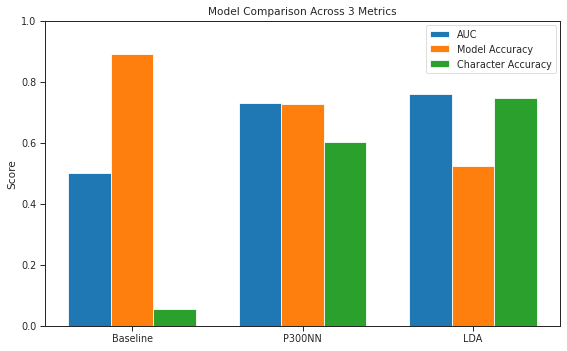
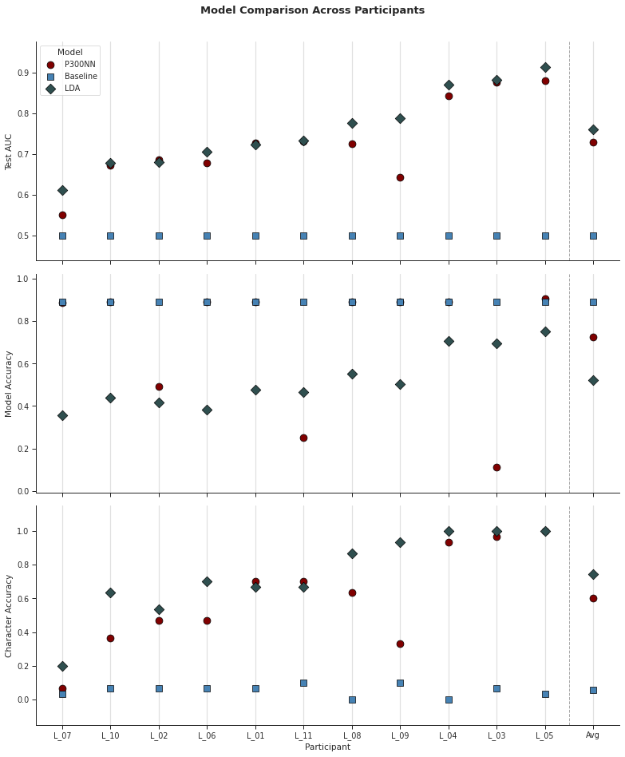

# NeuroSpell: Translating EEG Signals into Text Using Machine Learning

## What it Does

We were curious about one question: how can brain signals actually be turned into something useful? Specifically, we wanted to see for ourselves whether EEG, the electrical signals your brain produces, could be used to spell words, just by thinking about letters on a screen. This led us to the P300 BCI (Brain Computer Interface) speller, a classic paradigm in neuroscience where a person watches a grid of letters flashing on a screen, and their brain produces a small signal called the P300 at around 300ms after they see a letter that they want to spell. We built a full pipeline that takes raw EEG recordings, cleans and processes the signals, trains machine learning models to detect that P300 response, and ultimately decodes which character the person intended, turning brain waves into text.

## Quick Start

Please see [SETUP.md](./SETUP.md) for full installation instructions and requirements.

Once set up, you will see the following project structure: 
 
 `src/` — Core source code shared across the project. Contains `Dataset.py` for data loading and preprocessing logic, and `Speller.py` for spelling decoding utility  used in the pipeline.
 
`models/` — Standalone Python implementations of each classifier. Includes `Baseline.py`, `LDA.py`, and `P300NN.py`, along with `_noClassBalance` variants of LDA and the P300 neural network that skip class rebalancing for preprocessing impact verification.
 
`notebooks/` — Jupyter notebooks for exploration, experimentation, and final evaluation. Start with `Init_Data_Analysis.ipynb` to understand how data is loaded and visualized. From there, explore `LDAFinal.ipynb` and `P300NNFinal.ipynb` for per-model results, the hyperparameter tuning and preprocessing test notebooks for experiment history, `ErrorAnalysis.ipynb` for a breakdown of failure cases, and finally `FinalEvaluation.ipynb` for the full end-to-end results of our experiment.
 
`data/` — Contains the raw and labelled EEG dataset files used for training and evaluation.

### Research Question/Goal

Can machine learning models reliably detect the P300 brainwave response from noisy EEG data well enough to decode intended characters and how do classical approaches like LDA compare to deep learning ones like CNNs in this setting?
This question is grounded in BCI  research, most notably Farwell & Donchin (1988), who first demonstrated that P300 signals could be used to spell words non-invasively. We wanted to reproduce and explore this pipeline ourselves using a modern open dataset (bigP3BCI, PhysioNet 2025) and compare how well different ML approaches hold up across participants with varying signal quality. The ability to decode intended characters from brainwaves has major implications for people with severe motor disabilities, such as those with ALS, who may have no other means of communication. Developing reliable, adaptable BCI spelling systems could meaningfully restore quality of life for these individuals.

### How the P300 Speller Works
 
When you're paying attention to something unexpected, your brain produces a distinctive electrical response about 300ms later: the P300. The speller exploits this by rapidly flashing rows and columns of a letter grid one at a time. The user focuses on their target letter, and every time the row or column containing that letter lights up, their brain produces a P300. All other flashes produce no such response.

The pipeline works in four stages:
 
1. Stimulus & Recording — The subject focuses on a target letter while rows and columns of a 6×6 grid flash in a random sequence. EEG is recorded continuously across multiple electrodes, typically over the central and parietal scalp regions most sensitive to the P300.
2. Preprocessing — Raw EEG is noisy. We apply bandpass and notch filtering to isolate the relevant frequency range and epoch the signal into short windows time-locked to each flash. Class imbalance is also addressed here, since only few of many flashes per sequence contain the target.
3. Classification — A model is trained to label each epoch as either a target (P300 present) or non-target (no P300). Because single-trial P300s are weak and buried in noise, multiple repetitions of the flash sequence are averaged together to boost the signal for classification.
4. Character Decoding — The classifier scores all 12 rows and columns. The intended character is decoded by finding the row and column with the highest scores — their intersection is the predicted letter. 

## Video Links

Video Links are included below as the files exceeded GitHub's filesize limit. 

| Video | Link |
|---|---|
| Demo Video | https://youtu.be/lsSXlFjFkb4 |
| Technical Walkthrough | https://youtu.be/714VuwKVd_M |

## Evaluation

We evaluated our models using three metrics that directly reflect whether the system can decode brain signals into the correct letters:

- AUC-ROC — how well the model separates target from non-target EEG epochs
- Model Classification Accuracy — percentage of correctly identified P300 events
- Character/Spelling Accuracy — percentage of characters correctly decoded end-to-end

We compared three approaches — a constant baseline, an LDA classifier, and a custom CNN (P300NN) — all trained and tested on the same data and preprocessing pipeline. Full results are in `notebooks/FinalEvaluation.ipynb`.

The Model Comparison plot above highlights how each algorithm (Baseline, P300NN, and LDA) performs on each of the three metrics. It shows that learning-based approaches outperform simpler baselines, and demonstrates the strong potential of machine learning methods for enabling spelling systems in brain-computer interfaces (BCIs).

The Participants Comparison plot above illustrates variability in performance across different subjects, emphasizing the challenges of generalization in EEG-based brain-computer interfaces due to individual differences in neural signals.

## Individual Contributions

| Contributor | Contributions |
|---|---|
| Arnav Gupta (ag796) | Custom CNN (P300NN), GPU training, hyperparameter tuning, optimizer selection, preprocessing pipeline, error analysis |
| Arjun Saha Choudhury (as1572) | LDA model, baseline model, Dataset class, Speller decoding pipeline, evaluation notebooks, qualitative analysis |
